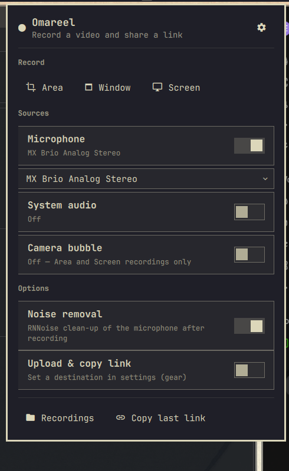
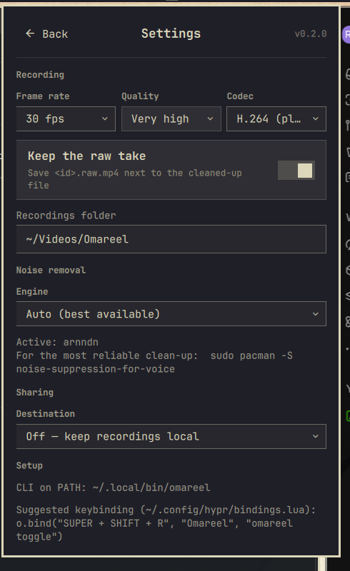
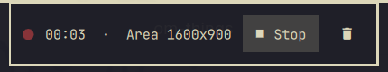
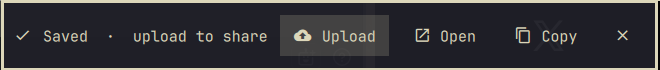
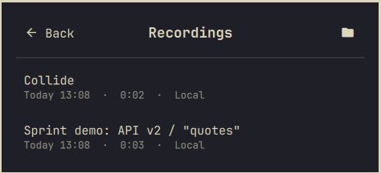

# Omareel

Loom-style screen recording for [Omarchy](https://omarchy.org). Record an
**area**, a **window**, or your **screen** with an optional camera frame and
the microphone you choose, get the background noise removed, and decide per
video whether it stays local or goes up as a shareable link, with a title.

<p align="center">
  
  
</p>

While recording an area, a small floating bar sits in a safe strip at the top
or bottom of the screen:

<p align="center">
  
  <br>
  
</p>

The Recordings page lists every take, newest first; click one to rename it,
upload it, or copy its link or path:

<p align="center">
  
</p>

## What it does

- **Record** an area (drag, or click a window to snap to it), a single visible
  window through reliable fixed-region capture, or the focused monitor. An
  optional portal mode keeps covered windows captured but is resize-sensitive.
  GPU encoding through `gpu-screen-recorder`.
- **Camera frame** in any corner of the recording: a rounded 16:9 frame
  (the Loom look), a circle, or a portrait card, in four sizes, with supported V4L2 cameras.
  It works the same way in every mode, like a screen studio: the camera is
  recorded to its own file and a self-view floats in the corner where the
  frame will be. Area, Screen, and reliable Window captures include that
  self-view as-is; a portal Window capture draws the frame in after Stop.
- **Pick your microphone** and your system-audio source from dropdowns.
- **Voice clean-up.** RNNoise reduces noise, with a small, time-aligned
  natural component to preserve speech detail. Neutral EQ and two-pass
  loudness normalisation keep the result consistent.
- **Instant playback for viewers.** The MP4 index is moved to the front so
  browsers start playing immediately and seek with range requests.
- **Share only what you choose.** After Stop the banner offers **Upload**;
  give the video a title and the link lands on your clipboard. Everything
  else stays in `~/Videos/Omareel`. Flip *Upload every recording* in the
  launcher if you would rather have every take uploaded automatically.
- **Name your videos.** A recording is saved under a random UUID. Rename it
  from the banner, the launcher, or the Recordings page and the mp4,
  thumbnail and raw take move together (`Sprint demo: API v2` →
  `Sprint-demo-API-v2.mp4`). The UUID stays the object key on the upload
  destination, so links never change and are never guessable.
- **Destinations:** Cloudflare R2, AWS S3, Backblaze B2, any S3-compatible
  endpoint, or any rclone remote you already have. A small player page
  (titled with your title) is uploaded next to the video.
- **Configure everything from the bar**, including the upload credentials.
  Credentials are written to rclone's own config file, never to the plugin's.

## Install

### Requirements

Omareel is an **Omarchy 4 / Hyprland / Quickshell plugin**, not a standalone
Windows, macOS, GNOME, or KDE app. Start it from your logged-in desktop session.
The release targets Omarchy's x86-64 packages. Other architectures are unverified.

Use the current Omarchy packages for `gpu-screen-recorder`, `ffmpeg` (with
libx264/AAC and audio filters), `python`, `jq`, `util-linux`, `coreutils`,
`wl-clipboard`, `xdg-utils`, and `slurp`. Microphone/system audio requires
`libpulse` (`pactl`). Cameras additionally need `mpv`, `v4l-utils`, and `psmisc`.
Omarchy supplies the shell, Hyprland, and capture helper commands. Uploads
need `rclone` and `curl`; the provider regression suite uses rclone 1.75.0.

`setup` probes capabilities instead of guessing compatibility from package
names alone. It checks the desktop connection, FFmpeg filters/encoders, recorder
options, GPU info, output storage, and the enabled inputs. A successful probe
does **not** replace a short real recording on a new laptop.

### First recording

```bash
omarchy plugin add https://github.com/hadijaveed/omareel.git --enable
~/.config/omarchy/plugins/hadijaveed.omareel/bin/omareel setup --link
```

`setup` checks dependencies, downloads pinned, checksum-verified RNNoise models, and symlinks
`omareel` into `~/.local/bin` so keybindings can call it. Then add a keybinding
in `~/.config/hypr/bindings.lua`:

```lua
o.bind("SUPER + SHIFT + R", "Omareel", "omareel toggle")
```

Optional but recommended for the most reliable noise removal (see below):

```bash
sudo pacman -S noise-suppression-for-voice
```

For uploads:

```bash
sudo pacman -S rclone
```

Open the Omareel bar button. Resolve any **Check your setup** message, choose
your microphone/camera (or leave the system defaults), then select Area,
Window, or Screen. Record 10 seconds, speak normally, move something on screen,
and **Stop & save**. Play the saved file before recording a long take.
For screen/window mode, Stop is in the Omareel system-bar widget; the floating
card is intentionally hidden. Upload is optional and happens after saving.

Microphone gain and mute are preserved by default, including after upgrading
older settings. A muted mic blocks starting until you unmute it or turn
Microphone off. **Set microphone volume when recording** is an explicit
advanced opt-in; it changes system volume but never unmutes the mic.
Camera input uses an advertised format/resolution/frame-rate combination.
If the selected camera cannot start, the take does not silently continue
without it: choose another device, close the app using it, or turn Camera off.
Stepwise-only, unsupported compressed formats, and non-V4L2 cameras are not
currently supported. Audio quality still depends on the microphone and room.

### Updates and removal

```bash
omarchy plugin update hadijaveed.omareel
omareel setup --link
```

Stop recording/processing before updating. Settings, recordings and upload
credentials live outside the plugin checkout and are retained. Do not edit
installed plugin files: local modifications can prevent a fast-forward update.
`setup --link` refuses to overwrite an unrelated command. If it reports a
conflict, inspect and move that existing command aside yourself before retrying.
For removal, use `omarchy plugin remove hadijaveed.omareel`; your recordings,
models, settings, credentials and optional CLI symlink are not deleted by us.
Remove the now-dangling symlink manually if you no longer want it.

See [release checks and UX review](docs/release-readiness.md) for test coverage
and remaining physical-device verification.

### Omarchy menu entries (optional)

Add to `~/.config/omarchy/extensions/omarchy-menu.jsonc` to get
Super+Space → Capture → Omareel:

```jsonc
"trigger.capture.omareel": {"icon":"󰑊","label":"Omareel","aliases":["omareel","record"],"description":"Record a video and share a link"},
"trigger.capture.omareel.stop": {"icon":"","label":"Stop recording","when":"omareel active","action":"omareel stop"},
"trigger.capture.omareel.cancel": {"icon":"󰜺","label":"Discard recording","when":"omareel active","action":"omareel cancel"},
"trigger.capture.omareel.area": {"icon":"󰆞","label":"Record area","when":"! omareel active","action":"omareel start area"},
"trigger.capture.omareel.window": {"icon":"","label":"Record window","when":"! omareel active","action":"omareel start window"},
"trigger.capture.omareel.screen": {"icon":"󰍹","label":"Record screen","when":"! omareel active","action":"omareel start screen"},
"trigger.capture.omareel.last": {"icon":"","label":"Copy last link","action":"omareel last"},
"trigger.capture.omareel.open": {"icon":"","label":"Open recordings","action":"omareel open"},
"trigger.capture.omareel.settings": {"icon":"","label":"Omareel settings","action":"omarchy-shell omareel settings"}
```

## Using it

**Bar button:** click → launcher (Stop while recording) · right-click → copy
the last link (Discard while recording) · middle-click → open the recordings
folder.

**Launcher:** pick Area / Window / Screen. Toggle the microphone, system audio
and camera and pick devices underneath each; the camera row also sets the
frame size, shape and corner. Toggle noise removal and automatic upload. The
gear opens settings.

**After Stop:** the floating banner (and the launcher) show the finished
recording with **Upload**, **Rename**, **Open** and **Copy**. Upload asks for
a title, renames the files to it, uploads the video, thumbnail and player
page, and copies the link. Rename only renames. The banner stays until you
upload it, close it (✕), or start the next recording; ✕ keeps the file local.

**Recordings page:** the *Recordings* button in the launcher (or
`omarchy-shell omareel recordings`) lists everything in `index.jsonl`. Click
a row for a name field plus Upload / Copy link or path / Open. Renaming a
video that is already shared re-uploads its player page with the new title.

The same from a terminal: `omareel upload last --title="…"`,
`omareel rename <file.mp4> "…"`, `omareel copy <file.mp4>`.

**Window/Screen controls:** the Omareel timer in the system bar is the Stop
control, shown as a red **REC · STOP** pill so no floating controls are burned
into the video. Click it to stop or right-click to open controls. Discard asks
for confirmation. Drag the pill to
move the Omareel widget anywhere along the bar; the whole bar can be configured
at the top or bottom.
Screen mode captures the monitor's usable rectangle, excluding its reserved
system bar. Other windows or notifications inside the selected region are
visible in KMS recordings; keep the intended content in place.

**Keyboard:** `omareel toggle` opens the launcher when idle and stops the
recording when one is running.

## Sharing setup

Open the gear, choose a destination, fill in the fields, **Save
credentials**, then **Test upload**. The test uploads a unique tiny probe,
checks its bytes through storage and the share URL, and deletes it. It never
uploads a recording. Read, sharing, and cleanup failures are shown separately.

| Destination | You need |
|---|---|
| **Cloudflare R2** | Account ID, bucket, the S3 Access Key ID + Secret Access Key generated for an Object Read & Write token (not the API token string), and optional public URL. |
| **AWS S3** | Region, bucket, access key + secret, and optional public URL (object/website endpoint or CloudFront). |
| **Backblaze B2** | Region (e.g. `us-west-004`), bucket, application key ID + key, and optional bucket friendly URL. |
| **S3-compatible** | Endpoint URL, bucket, key + secret, region if required by your service, and optional public URL. Advanced options use an existing rclone remote. |
| **Existing rclone remote** | A `remote:path` you already configured with `rclone config` (Google Drive, Dropbox, OneDrive…). Leave the public URL empty and the share link comes from `rclone link`. |

For permanent player-page links, set the bucket's public URL and allow the
intended public access (or use a public CDN). Omareel never changes bucket
permissions. Leave Public URL blank for a provider-generated link: S3 links
last up to seven days; other remotes determine their own link behavior.
Not every rclone backend supports share links.

For built-in providers, the Folder is automatically appended to the bucket's
public URL. For Existing remote, Public URL already refers to the full path.
Spaces and Unicode in object paths are URL-encoded. Recording UUIDs survive
local renames but are not access control: anyone with a share link can view it.
Uploads set explicit `Content-Type` and `Content-Disposition: inline` headers
and the player page carries Open Graph video tags, so Slack, Teams and
friends unfurl the link as a page with a poster and a click opens the player.

Credentials are stored by `omareel remote save` in
`~/.config/rclone/rclone.conf` (mode 600) under the `[omareel]` remote.
`~/.config/omarchy/omareel.json` holds only the non-secret settings, which
makes it safe to keep in a dotfiles repo.

## Camera layouts

Camera layout is built from four independent controls, available in the
launcher whenever Camera is on:

- **Position:** all four corners, top/bottom center, and left/right center.
- **Frame:** Landscape 16:9, Rectangle 4:3, Portrait 8:9, or Circle.
- **Crop:** Full, Close (1.25×), or Tight (1.5×). Crops remain centered and
  never stretch the camera image.
- **Size:** Small, Medium, Large, or Extra large.

Useful starting points are Circle + Medium + Close at bottom-right for product
demos, Rectangle + Large + Close at right-center for a presenter layout, and
Portrait + Medium + Tight at left-center when the UI needs the right side.
Every layout stays inside a 3 % safe margin. Omareel snapshots the selection
when recording begins and uses the same size, crop, mask, and position math for
the live self-view and Window-mode export.

## Noise removal

Microphone and desktop audio are captured as separate tracks. Only the
microphone goes through the speech chain: convert to 48 kHz mono → apply a
configurable pre-gain → cut rumble below 70 Hz → denoise → neutral tone →
light compression → mix desktop audio at 50% → two-pass `loudnorm` to −16 LUFS
→ a −1.5 dB true-peak safety limiter. Desktop audio bypasses microphone
denoising, but the final mix is still levelled when voice cleanup is enabled.

Omareel preserves system microphone volume and mute. If another app changes
your gain, correct it in system audio settings or explicitly enable **Set
microphone volume when recording**. No percentage suits every microphone.

### Choose a voice preset in one minute

Start with **Clean**. Record ten seconds of normal speech plus a short pause,
then listen to the saved video. If speech sounds muffled or unnatural, choose
**Natural** or turn cleanup off. Use **Strong** only when persistent background
noise matters more than natural tone. Keep Engine on Auto unless diagnosing
a specific problem. Noise suppression is not guaranteed room-echo removal;
mic placement, room acoustics and avoiding input clipping still matter.

Raw recordings are kept by default so processing can be revisited without
having to repeat the screen demonstration. Synthetic audio tests check timing
and safety; they do not replace listening on your own microphone.

**Strength** controls the whole cleanup profile: *Natural* uses minimal FFT
processing, while *Clean* (the default) and *Strong* use RNNoise voice
isolation. Clean combines 85% denoised speech with 15% time-aligned original
speech. A soft gate, guided by the cleaned voice, reduces that natural
component during pauses so it does not restore room noise. Strong uses the
fully denoised signal and firmer levelling, at the cost of more altered tone.
No preset adds bass or cuts the presence band by default.
Very quiet takes have make-up gain capped at 18 dB, so a mostly silent take
does not amplify faint room noise up to speech level.

Omareel measures the installed LADSPA model's delay, feeds it in 10 ms blocks,
flushes the tail, and removes the measured delay before mixing. The installed
1.21 model adds 20 ms on top of VAD look-ahead; its internal Dry Mix does not
account for that model delay. Omareel therefore leaves internal Dry Mix at
zero and aligns the paths itself. Failed latency calibration triggers the
fallback engine rather than an unaligned mix. The default VAD threshold is
50%, with 300 ms tail grace and 50 ms retroactive grace.

The engine setting `auto` selects transparent `afftdn` cleanup for Natural and
RNNoise LADSPA for Clean and Strong when the plugin is installed. If LADSPA is
unavailable, it tries the downloaded RNNoise model before falling back to FFT
cleanup. An explicit engine selection overrides that behavior:

1. **RNNoise LADSPA plugin** from the `noise-suppression-for-voice` package.
   Aggressive suppression for a difficult room.
2. **ffmpeg `arnndn`** with the models `omareel setup` downloads. ffmpeg
   9.0.1's `arnndn` intermittently emits NaN samples, which makes the AAC
   encoder abort, so Omareel retries it a few times before falling back.
3. **ffmpeg `afftdn`**, a plain FFT denoiser. The Clean and Strong profiles
   follow it with a soft downward expander: room tone stays down between words
   even after loudness levelling, without a hard gate clipping syllables.

The raw take is kept as `<id>.raw.mp4` (toggle in settings), so a bad clean-up
can always be redone with `omareel finalize <raw.mp4>`.
Turning Voice clean-up off also bypasses tone, compression, and loudness
normalisation; only the short capture-pop mute and audio encoding remain.

Processed audio timestamps are rebuilt from the output sample count to prevent
filter-generated playback gaps without changing the audio samples.

Saved actions stay available until Close or the next recording. Recording,
processing, and sharing commands are serialized; a duplicate click cannot
start a second picker or finalize the same file twice. Settings writes are
also serialized so rapidly changing multiple options preserves each change.

### Regression checks

Run `python3 tests/audio-regression.py` for local DSP tests (FFmpeg and the
RNNoise LADSPA plugin required), `python3 tests/workflow-regression.py` for
isolated workflow tests, and `node tests/helpers.js` for card placement and
configuration helpers. Run python3 tests/upload-regression.py for provider
configuration, failure paths and local HTTPS S3 integration (rclone 1.75.0,
FFmpeg, Python 3, jq, curl and OpenSSL). Fixtures and credentials are synthetic;
tests never contact cloud accounts or upload a real recording. GitHub Actions
runs upload, workflow, setup/camera, helper and audio tests on pushes and pull requests.
Run `python3 tests/setup-regression.py` for synthetic first-run and failure
tests. CI builds a pinned RNNoise LADSPA release and fails if it is missing,
so the audio suite cannot silently skip.
See [provider setup and verification limits](docs/upload-providers.md).
DSP checks cover timing at multiple look-ahead
settings, the final partial frame, silence, cleanup Off, and untouched desktop
audio. A listening check on your own microphone remains necessary to choose
between Natural, Clean, and Strong.

## CLI

```
omareel start [area|window|screen] [--no-mic] [--desktop-audio] [--webcam] [--no-denoise] [--no-upload]
omareel stop | cancel | dismiss | toggle | status | last | open
omareel upload last|<video.mp4> [--title="…"]   # share one recording
omareel rename last|<video.mp4> "<title>"        # rename mp4 + thumbnail + raw
omareel copy   last|<video.mp4>                  # copy its link, or path if local
omareel devices                      # JSON: mics, outputs, cameras
omareel doctor                       # JSON: deps, active denoiser, upload state
omareel config get | merge '<json>'  # read / deep-merge omareel.json
omareel remote save|status|test      # upload credentials → rclone.conf
omareel finalize <raw.mp4> [out.mp4]
omareel setup [--link]

omarchy-shell omareel open|close|toggle|settings|recordings|status|refresh
```

Headless smoke test (no picker):

```bash
omareel start area --region=1280x720+200+200 --no-upload; sleep 4; omareel stop
```

## Config

`~/.config/omarchy/omareel.json`, all editable from the settings page:

```jsonc
{
  "outputDir": "~/Videos/Omareel",
  "fps": 30,                  // 30 | 60
  "codec": "h264",            // h264 (plays everywhere) | hevc | av1
  "quality": "very_high",     // medium | high | very_high | ultra
  "windowCaptureMode": "region", // region (reliable) | portal (occlusion-safe)
  "mic": true,          "micDevice": "default",
  "manageMicVolume": false, // preserve system gain unless explicitly enabled
  "micVolumePercent": 80,   // used only when manageMicVolume is true
  "desktopAudio": false, "desktopDevice": "default",
  "webcam": false,       "webcamDevice": "auto",
  "webcamSize": "medium",     // small | medium | large | xlarge (16/22/30/40 % of the recording height)
  "webcamShape": "frame",     // frame (16:9) | classic (4:3) | portrait (8:9) | circle
  "webcamPosition": "bottom-right", // 4 corners | top/bottom-center | center-left/right
  "webcamZoom": "full",       // full | close (1.25x) | tight (1.5x)
  "denoise": true,
  "denoiseEngine": "auto",    // auto | ladspa | arnndn | afftdn | off
  "denoiseModel": "bd",       // arnndn model: bd (general) | sh (speech)
  "denoiseStrength": "normal", // light/natural | normal/clean | strong
  "micGainDb": 0,             // optional processing pre-gain after capture
  "vadThreshold": 50,         // LADSPA voice gate, %
  "vadGraceMs": 300,          // keep word and sentence endings
  "vadRetroactiveMs": 50,     // recover beginnings; adds this much denoiser latency
  "desktopMix": 0.5,          // desktop level when mixed with a microphone
  "keepRaw": true,
  "upload": {
    "auto": false,              // true: upload every recording without asking
    "provider": "none",       // none | r2 | s3 | b2 | s3compat | existing
    "accountId": "", "region": "", "endpoint": "",
    "bucket": "", "prefix": "", "remote": "",
    "publicBase": "",
    "playerPage": true
  }
}
```

## How it works

```
launcher / keybind / menu
        │
        ▼
bin/omareel start …          gpu-screen-recorder (VAAPI/NVENC); ffmpeg records the camera to
                             <id>.cam.mp4 and tees it to an mpv self-view
        │  state.json: picking → recording        ← Panel.qml shows the floating bar
        ▼
bin/omareel stop
        ├─ ffmpeg: mic → highpass → selected denoiser → voice EQ/compression
        │          desktop audio → mix after cleanup → 2-pass loudnorm/limiter → +faststart
        │          + camera overlay for optional portal Window recordings
        ├─ thumbnail, index.jsonl  (<uuid>.mp4 until renamed)
        ├─ wl-copy path, notification
        │  state.json: processing → done (banner: Upload / Open / Copy)
        ▼
bin/omareel upload last --title="…"       (Upload button, or upload.auto)
        ├─ rclone copyto  <id>.mp4 <id>.jpg <id>.html
        └─ wl-copy URL, notification
           state.json: uploading → done → idle
```

The shell plugin never talks to the recorder directly. `bin/omareel` writes
`$XDG_RUNTIME_DIR/omareel/state.json` on every phase change and both QML files
watch it, so the bar button, the floating controls, and the CLI always agree.

## Known limits

- Floating controls are part of the screen, so Window and whole-screen
  recordings hide them; the movable system-bar timer and the keybinding still
  stop the recording. Area recordings use a safe top or bottom strip and hide
  the card when neither is outside the selected region.
- **A camera can only stream to one program at a time.** If Chromium,
  Firefox or a call app holds it (a Meet, Slack or Teams call, or a tab that
  was granted the camera), the camera cannot start. Omareel says so in the
  launcher ("In use by Chromium") and in a notification, and records without
  the camera. End the call or close that tab, then record again.
- Reliable Window mode records a fixed on-screen rectangle. Keep the selected
  window visible and in place during the take; covered pixels are recorded as
  covered. This avoids portal freezes caused by dynamic window resizing.
- Optional portal Window mode remains available in settings for occlusion-safe
  capture. Portal recordings with a camera are re-encoded once to composite
  the camera frame and may fail if the portal renegotiates its dimensions.
- No pause/resume yet.

## Developing

`BarWidget.qml`, `Panel.qml`, and `Omareel.js` hot-reload on save; manifest
changes need `omarchy restart shell`. Shell log:
`ls -t /run/user/1000/quickshell/by-id/*/log.log | head -1`. Recorder and
ffmpeg log: `$XDG_RUNTIME_DIR/omareel/omareel.log`.

## License

MIT
