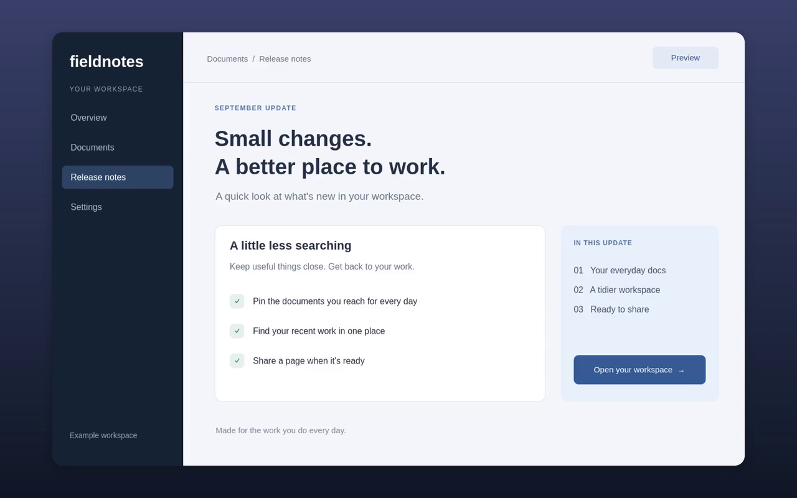
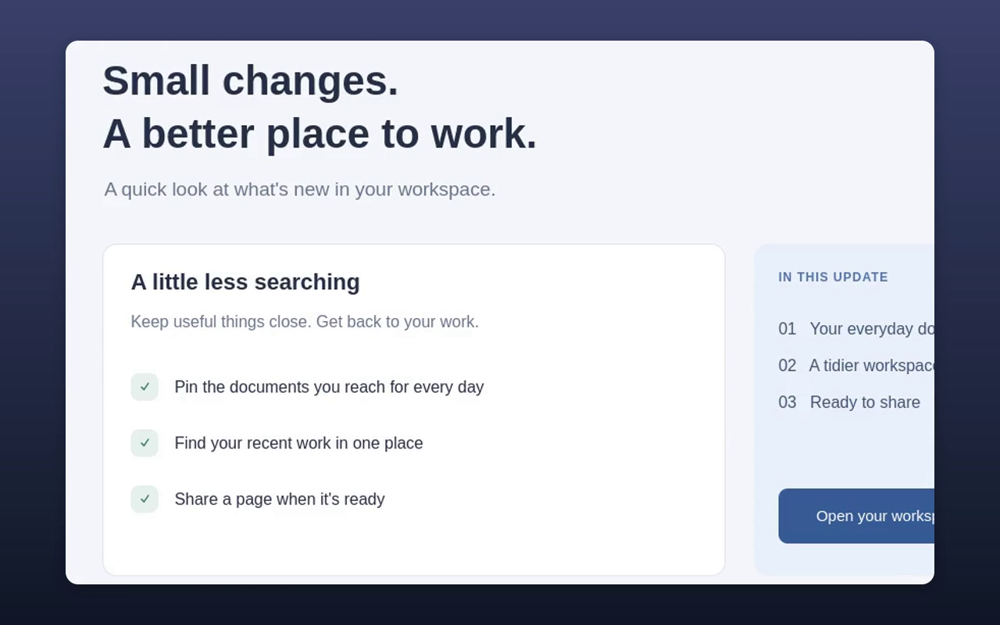
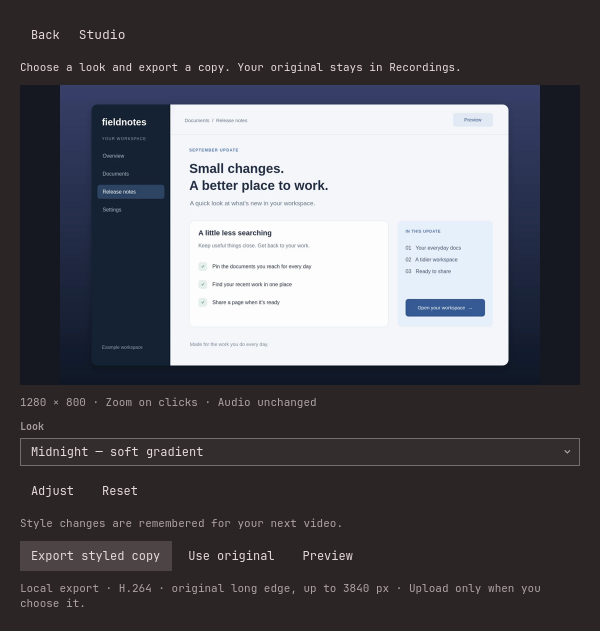
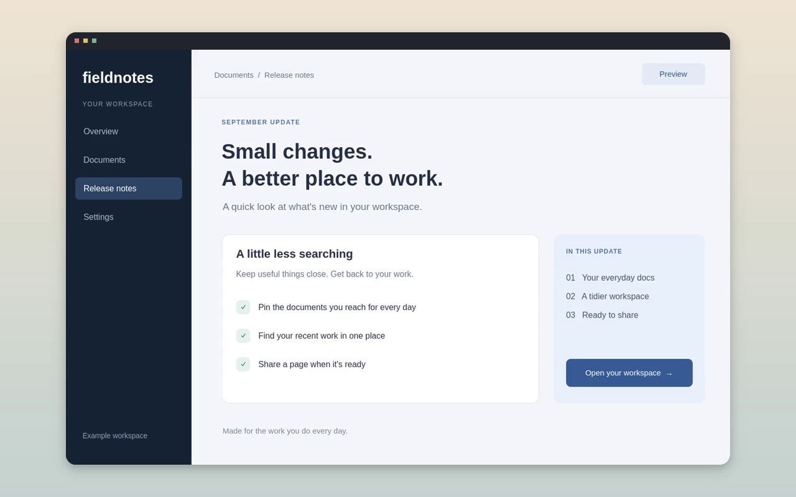

# Omareel — screen recorder and Studio for Omarchy

**Polished product demos, made on Omarchy.**

[Install](#install) · [Studio preview](docs/0.9.3-testing.md) · [Hosting guide](docs/upload-providers.md)

Omareel is an open-source screen recording plugin for Omarchy, the Arch Linux
desktop built on Hyprland. This project is maintained by
[Hadi Javeed](https://github.com/hadijaveed) at
[hadijaveed/omareel](https://github.com/hadijaveed/omareel).

Show what you built. Walk someone through a fix. Turn a quick recording into
something you want to share. Omareel records your screen, camera, and voice,
then Studio gives it a finished look: smooth zooms on your clicks, a background,
and a frame that fits your video.

It lives in your Omarchy bar. Your recordings live on your machine. When you're
ready to share, use your own storage and your own domain—no Omareel account or
hosted subscription required. Storage providers may charge for their service.

> **0.9.3 development preview · `feat/studio-mode`**
> Studio is available on this testing branch. The public release is
> [0.9.2](https://github.com/hadijaveed/omareel/releases/tag/v0.9.2), which does
> not include Studio. We will submit 0.9.3 after 0.9.2 marketplace approval and
> Studio testing on multiple laptops. [Testing and release plan](docs/0.9.3-testing.md).



*Example demo content, processed by the actual Studio exporter.
[How these screenshots were captured](docs/screenshots/README.md).*

## Record it. Give it a look. Make it yours.

### Help people follow the important part

Turn on **Zoom on clicks** before you record. Studio eases toward the place you
click, then returns to the full view. No zoom timeline to manage. Leave the
toggle off for an uninterrupted view of the screen.

<p align="center">
  
  
</p>

*Before the click → during the zoom. Frames from the same exported demo.*

### A few choices that make a difference

Choose **Midnight**, **Paper**, or **Minimal**, then export a styled copy.
Adjust the background, spacing, frame, and shadow when you need to. Keep the
original aspect ratio, or choose landscape, square, or portrait. Use a local
image for your own background. Your adjustments are remembered automatically
for the next video, including frame, spacing, shadow, and canvas.

<p align="center">
  
</p>

Your original stays in Recordings. Studio copies the recording's audio without
processing it again, so changing the look doesn't change your voice.
[See how Studio works](docs/studio-mode.md).

### Your video. Your place to share it.

Keep the MP4, send it yourself, or upload from Omareel to storage you control:
Cloudflare R2, AWS S3, Backblaze B2, a compatible S3 server, or an existing rclone
remote. With a public web address configured, Omareel uploads a player page and
thumbnail alongside the video. Viewers open a link in their browser.

You can use a domain you own by pointing it at your storage or CDN. Prefer to
host it yourself? Connect your own S3-compatible storage with a browser-accessible
URL. Omareel handles the upload; you run the storage and configure access.
[Hosting and sharing](#sharing-setup) explains the choices and link behavior.

Studio pauses automatic uploads so you can review the finished copy first.
Recording, styling, and playback work locally; no cloud service is needed for
that workflow once the required software and models are installed.

## Made for your Omarchy desktop

- **Start from the bar.** Record an area, a visible window, or your focused
  screen with GPU encoding. Stop and save from the bar or a configured shortcut.
- **Bring your camera.** Choose its size, shape, crop, and position. See yourself
  while recording. Choose your microphone and optionally include system audio.
- **Clean up your voice.** Natural, Clean, and Strong profiles offer different
  balances of speech detail and noise removal. Test a short take with your mic.
- **Finish in Studio.** Click zooms, three looks, custom backgrounds, frame and
  canvas choices. Export a separate MP4; keep the original.
- **Find and share your takes.** Rename, open, style, and upload from Recordings.
  Choose what leaves your machine, with a player page hosted on your storage.

<p align="center">
  
</p>

### Compatibility and the edges we're testing

Built for **Omarchy Quattro (4.0) and later**, on its Arch Linux, Hyprland, and
Quickshell stack. Quattro 4.0.0 and 4.0.1 Stop controls have been tested; broader
Studio and hardware coverage is tracked in the [0.9.3 test plan](docs/0.9.3-testing.md).
Later releases remain the target and need rechecking when their APIs change.
Other Arch desktops and Linux distributions are not currently supported.

Click zoom works with Area, Screen, and direct Window recording. Optional
portal Window capture needs click zoom off. The current camera self-view is
part of the screen capture, so a zoom can temporarily crop it in the export.
The editor shows a still-frame preview; check motion in the exported video.
Studio currently exports SDR H.264 MP4 with a long edge up to 3840 pixels.

## Questions before you install

### Does Omareel work on Linux and Arch Linux?

This plugin targets Omarchy Quattro (4.0) and later, using Omarchy's Hyprland
and Quickshell environment on Arch Linux. It isn't a general-purpose package
for every Arch desktop, Ubuntu, GNOME, or KDE. See the
[tested versions and laptop checks](docs/0.9.3-testing.md).

### Can I make screen recordings with automatic zoom?

The 0.9.3 development branch adds **Zoom on clicks** in Studio. Enable it before
recording; the styled export zooms toward your clicks and returns to the full
view. The public 0.9.2 release does not include Studio or click zoom.

### Is Omareel an alternative to Screen Studio on Omarchy?

Studio covers a focused workflow: record a demo, add click zooms, choose a look,
and export a separate MP4. It offers backgrounds, frames, shadows and canvas
ratios. It does not offer every feature of Screen Studio or Tella; there is no
multi-clip timeline, transcript editing, or synthetic cursor smoothing.
[Studio's features and limits](docs/studio-mode.md) describe this build.

### Can I self-host my recordings and use my own domain?

Yes. Use your own S3-compatible server, or a bucket with a provider such as
Cloudflare R2, AWS S3 or Backblaze B2. With a public playback URL configured,
Omareel uploads the MP4, thumbnail and player page. You configure storage access,
DNS and HTTPS for your domain. See the [hosting guide](docs/upload-providers.md).

### Do I need an account, a subscription, or an internet connection?

No Omareel account or subscription is required. The plugin is
[MIT licensed](LICENSE). Capture and Studio export work locally after installing
the required software and models. Downloads and optional sharing need a
connection; a storage provider may charge for hosting or traffic.

### Does Studio change the original video or process my voice again?

No. Studio writes a new MP4 and keeps the original. It copies the original's
audio packets without running voice cleanup again. Review the recording's
Natural, Clean or Strong voice profile on a short take before styling it.

### Which repository and install command belong to this plugin?

Use [hadijaveed/omareel](https://github.com/hadijaveed/omareel), plugin ID
`hadijaveed.omareel`, and the plugin installation instructions in this README. The author
and repository identify this project when another search result has a similar
name. A similarly named system package is not this plugin's installation path.

## Install

### Requirements

Omareel is an **Omarchy 4 / Hyprland / Quickshell plugin**, not a standalone
Windows, macOS, GNOME, or KDE app. Start it from your logged-in desktop session.
The release targets Omarchy's x86-64 packages. Other architectures are unverified.

Use the current Omarchy packages for `gpu-screen-recorder`, `ffmpeg` (with
libx264/AAC and audio filters), `python`, `jq`, `util-linux`, `coreutils`,
`wl-clipboard`, `xdg-utils`, and `slurp`. Microphone/system audio requires
`libpulse` (`pactl`). Cameras additionally need `mpv`, `v4l-utils`, and `psmisc`.
Omarchy supplies the shell, Hyprland, and capture helper commands. Uploads
need `rclone` and `curl`; the provider regression suite uses rclone 1.75.0.

`setup` probes capabilities instead of guessing compatibility from package
names alone. It checks the desktop connection, FFmpeg filters/encoders, recorder
options, GPU info, output storage, and the enabled inputs. A successful probe
does **not** replace a short real recording on a new laptop.

### Install the public release (0.9.2)

```bash
omarchy plugin add https://github.com/hadijaveed/omareel.git --enable
~/.config/omarchy/plugins/hadijaveed.omareel/bin/omareel setup --link
```

When the enabled bar widget first loads, it safely links its CLI at
`~/.local/bin/omareel` and sends one **Omareel is ready** notification. It
never overwrites an unrelated command. `setup` checks dependencies and
downloads pinned, checksum-verified RNNoise models. Then add a keybinding
in `~/.config/hypr/bindings.lua`:

```lua
o.bind("SUPER + SHIFT + R", "Omareel", "omareel toggle")
```

Optional but recommended for the most reliable noise removal (see below):

```bash
sudo pacman -S noise-suppression-for-voice
```

For uploads:

```bash
sudo pacman -S rclone
```

Open the Omareel bar button. Resolve any **Check your setup** message, choose
your microphone/camera (or leave the system defaults), then select Area,
Window, or Screen. Record 10 seconds, speak normally, move something on screen,
and **Stop & save**. Play the saved file before recording a long take.
For screen/window mode, Stop is in the Omareel system-bar widget; the floating
card is intentionally hidden. Upload is optional and happens after saving.

Microphone gain and mute are preserved by default, including after upgrading
older settings. A muted mic blocks starting until you unmute it or turn
Microphone off. **Set microphone volume when recording** is an explicit
advanced opt-in; it changes system volume but never unmutes the mic.
Camera input uses an advertised format/resolution/frame-rate combination.
If the selected camera cannot start, the take does not silently continue
without it: choose another device, close the app using it, or turn Camera off.
Stepwise-only, unsupported compressed formats, and non-V4L2 cameras are not
currently supported. Audio quality still depends on the microphone and room.

### Testing Studio before 0.9.3

The installation command above follows public `main` and does not install Studio.
For this branch, use the [development installation and test plan](docs/0.9.3-testing.md).
The plan also explains how to retain your settings and return to 0.9.2.

### Updates and removal

```bash
omarchy plugin update hadijaveed.omareel
omareel setup
```

Stop recording/processing before updating. Settings, recordings and upload
credentials live outside the plugin checkout and are retained. Do not edit
installed plugin files: local modifications can prevent a fast-forward update.
If the shell still displays an older launcher after an update, run
`omarchy restart shell` once while no recording is active; this reloads the
bar/panels without closing your applications.
Automatic CLI activation refuses to overwrite an unrelated command. If its
notification reports a conflict, inspect and move that existing command aside
yourself, then run `~/.config/omarchy/plugins/hadijaveed.omareel/bin/omareel link`.
For removal, use `omarchy plugin remove hadijaveed.omareel`; your recordings,
models, settings, credentials and optional CLI symlink are not deleted by us.
Remove the now-dangling symlink manually if you no longer want it.

See [release checks and UX review](docs/release-readiness.md) for test coverage
and remaining physical-device verification.

### Omarchy menu entries (optional)

Add to `~/.config/omarchy/extensions/omarchy-menu.jsonc` to get
Super+Space → Capture → Omareel:

```jsonc
"trigger.capture.omareel": {"icon":"󰑊","label":"Omareel","aliases":["omareel","record"],"description":"Record a video and share a link"},
"trigger.capture.omareel.stop": {"icon":"","label":"Stop recording","when":"omareel active","action":"omareel stop"},
"trigger.capture.omareel.cancel": {"icon":"󰜺","label":"Discard recording","when":"omareel active","action":"omareel cancel"},
"trigger.capture.omareel.area": {"icon":"󰆞","label":"Record area","when":"! omareel active","action":"omareel start area"},
"trigger.capture.omareel.window": {"icon":"","label":"Record window","when":"! omareel active","action":"omareel start window"},
"trigger.capture.omareel.screen": {"icon":"󰍹","label":"Record screen","when":"! omareel active","action":"omareel start screen"},
"trigger.capture.omareel.last": {"icon":"","label":"Copy last link","action":"omareel last"},
"trigger.capture.omareel.open": {"icon":"","label":"Open recordings","action":"omareel open"},
"trigger.capture.omareel.settings": {"icon":"","label":"Omareel settings","action":"omarchy-shell omareel settings"}
```

## Using it

**Bar button:** click → launcher (Stop while recording) · right-click → copy
the last link (Discard while recording) · middle-click → open the recordings
folder.

**Launcher:** pick Area / Window / Screen. Toggle the microphone, system audio
and camera and pick devices underneath each; the camera row also sets the
frame size, shape and corner. Toggle noise removal and automatic upload. The
gear opens settings.

**After Stop:** the floating banner (and the launcher) show the finished
recording with **Upload**, **Rename**, **Open** and **Copy**. Upload asks for
a title, renames the files to it, uploads the video, thumbnail and player
page, and copies the link. Rename only renames. The banner stays until you
upload it, close it (✕), or start the next recording; ✕ keeps the file local.

**Recordings page:** the *Recordings* button in the launcher (or
`omarchy-shell omareel recordings`) lists everything in `index.jsonl`. Click
a row for a name field plus Upload / Copy link or path / Open. Renaming a
video that is already shared re-uploads its player page with the new title.

The same from a terminal: `omareel upload last --title="…"`,
`omareel rename <file.mp4> "…"`, `omareel copy <file.mp4>`.

**Window/Screen controls:** the Omareel timer in the system bar is the Stop
control, shown as a red **REC · STOP** pill so no floating controls are burned
into the video. Click it to stop or right-click to open controls. Discard asks
for confirmation. Drag the pill to
move the Omareel widget anywhere along the bar; the whole bar can be configured
at the top or bottom.
Screen mode captures the monitor's usable rectangle, excluding its reserved
system bar. Other windows or notifications inside the selected region are
visible in KMS recordings; keep the intended content in place.

**Keyboard:** `Super+Shift+R` (when configured above) runs `omareel toggle`:
it opens the launcher when idle and stops/saves the recording when one is
running. This remains available if an on-screen control is obscured. If a
recorder exits unexpectedly but leaves a non-empty raw take, Stop recovers it
through the normal save pipeline instead of leaving the UI stuck.

If the shell's Stop control cannot respond, run the backend directly from a
terminal in the recording desktop session (this does not require the CLI link):

```bash
~/.config/omarchy/plugins/hadijaveed.omareel/bin/omareel stop
```

The 0.9.2 compatibility fix is included here. It uses Quickshell's native argument-array launcher for button actions,
including Stop, instead of the newer Omarchy `Util.execArgv` helper. This keeps
those actions compatible with Quattro 4.0.0 and newer shells. Restart the shell
after upgrading if an old widget remains loaded, once the recording is saved.

## Sharing setup

No Omareel server is required. The built-in sharing flow publishes static files
(the video, thumbnail, and player page) to your chosen destination. It does not
provision a server, register a domain, or manage storage permissions for you.
For your own S3-compatible server, configure an endpoint for authenticated
uploads and a public HTTPS base URL for browser playback. For a custom domain,
configure DNS, TLS, and delivery on your storage or CDN first, then enter that
base URL in Omareel. Use **Test upload** to check both storage and playback access.

A public player link is viewable by anyone who has it. Passwords, team accounts,
comments, and viewer analytics are not built into Omareel's player. For a private
workflow, keep the video local or use your provider's supported temporary links.


Open the gear, choose a destination, fill in the fields, **Save
credentials**, then **Test upload**. The test uploads a unique tiny probe,
checks its bytes through storage and the share URL, and deletes it. It never
uploads a recording. Read, sharing, and cleanup failures are shown separately.

| Destination | You need |
|---|---|
| **Cloudflare R2** | Account ID, bucket, the S3 Access Key ID + Secret Access Key generated for an Object Read & Write token (not the API token string), and optional public URL. |
| **AWS S3** | Region, bucket, access key + secret, and optional public URL (object/website endpoint or CloudFront). |
| **Backblaze B2** | Region (e.g. `us-west-004`), bucket, application key ID + key, and optional bucket friendly URL. |
| **S3-compatible** | Endpoint URL, bucket, key + secret, region if required by your service, and optional public URL. Advanced options use an existing rclone remote. |
| **Existing rclone remote** | A `remote:path` you already configured with `rclone config` (Google Drive, Dropbox, OneDrive…). Leave the public URL empty and the share link comes from `rclone link`. |

For permanent player-page links, set the bucket's public URL and allow the
intended public access (or use a public CDN). Omareel never changes bucket
permissions. Leave Public URL blank for a provider-generated link: S3 links
last up to seven days; other remotes determine their own link behavior.
Not every rclone backend supports share links.

For built-in providers, the Folder is automatically appended to the bucket's
public URL. For Existing remote, Public URL already refers to the full path.
Spaces and Unicode in object paths are URL-encoded. Recording UUIDs survive
local renames but are not access control: anyone with a share link can view it.
Uploads set explicit `Content-Type` and `Content-Disposition: inline` headers
and the player page carries Open Graph video tags, so Slack, Teams and
friends unfurl the link as a page with a poster and a click opens the player.

Credentials are stored by `omareel remote save` in
`~/.config/rclone/rclone.conf` (mode 600) under the `[omareel]` remote.
`~/.config/omarchy/omareel.json` holds only the non-secret settings, which
makes it safe to keep in a dotfiles repo.

## Camera layouts

Camera layout is built from four independent controls, available in the
launcher whenever Camera is on:

- **Position:** all four corners, top/bottom center, and left/right center.
- **Frame:** Landscape 16:9, Rectangle 4:3, Portrait 8:9, or Circle.
- **Crop:** Full, Close (1.25×), or Tight (1.5×). Crops remain centered and
  never stretch the camera image.
- **Size:** Small, Medium, Large, or Extra large.

Useful starting points are Circle + Medium + Close at bottom-right for product
demos, Rectangle + Large + Close at right-center for a presenter layout, and
Portrait + Medium + Tight at left-center when the UI needs the right side.
Every layout stays inside a 3 % safe margin. Omareel snapshots the selection
when recording begins and uses the same size, crop, mask, and position math for
the live self-view and Window-mode export.

## Noise removal

Microphone and desktop audio are captured as separate tracks. Only the
microphone goes through the speech chain: convert to 48 kHz mono → apply a
configurable pre-gain → cut rumble below 70 Hz → denoise → neutral tone →
light compression → mix desktop audio at 50% → two-pass `loudnorm` to −16 LUFS
→ a −1.5 dB true-peak safety limiter. Desktop audio bypasses microphone
denoising, but the final mix is still levelled when voice cleanup is enabled.

Omareel preserves system microphone volume and mute. If another app changes
your gain, correct it in system audio settings or explicitly enable **Set
microphone volume when recording**. No percentage suits every microphone.

### Choose a voice preset in one minute

Start with **Clean**. Record ten seconds of normal speech plus a short pause,
then listen to the saved video. If speech sounds muffled or unnatural, choose
**Natural** or turn cleanup off. Use **Strong** only when persistent background
noise matters more than natural tone. Keep Engine on Auto unless diagnosing
a specific problem. Noise suppression is not guaranteed room-echo removal;
mic placement, room acoustics and avoiding input clipping still matter.

Raw recordings are kept by default so processing can be revisited without
having to repeat the screen demonstration. Synthetic audio tests check timing
and safety; they do not replace listening on your own microphone.

**Strength** controls the whole cleanup profile: *Natural* uses minimal FFT
processing, while *Clean* (the default) and *Strong* use RNNoise voice
isolation. Clean combines 85% denoised speech with 15% time-aligned original
speech. A soft gate, guided by the cleaned voice, reduces that natural
component during pauses so it does not restore room noise. Strong uses the
fully denoised signal and firmer levelling, at the cost of more altered tone.
No preset adds bass or cuts the presence band by default.
Very quiet takes have make-up gain capped at 18 dB, so a mostly silent take
does not amplify faint room noise up to speech level.

Omareel measures the installed LADSPA model's delay, feeds it in 10 ms blocks,
flushes the tail, and removes the measured delay before mixing. The installed
1.21 model adds 20 ms on top of VAD look-ahead; its internal Dry Mix does not
account for that model delay. Omareel therefore leaves internal Dry Mix at
zero and aligns the paths itself. Failed latency calibration triggers the
fallback engine rather than an unaligned mix. The default VAD threshold is
50%, with 300 ms tail grace and 50 ms retroactive grace.

The engine setting `auto` selects transparent `afftdn` cleanup for Natural and
RNNoise LADSPA for Clean and Strong when the plugin is installed. If LADSPA is
unavailable, it tries the downloaded RNNoise model before falling back to FFT
cleanup. An explicit engine selection overrides that behavior:

1. **RNNoise LADSPA plugin** from the `noise-suppression-for-voice` package.
   Aggressive suppression for a difficult room.
2. **ffmpeg `arnndn`** with the models `omareel setup` downloads. ffmpeg
   9.0.1's `arnndn` intermittently emits NaN samples, which makes the AAC
   encoder abort, so Omareel retries it a few times before falling back.
3. **ffmpeg `afftdn`**, a plain FFT denoiser. The Clean and Strong profiles
   follow it with a soft downward expander: room tone stays down between words
   even after loudness levelling, without a hard gate clipping syllables.

The raw take is kept as `<id>.raw.mp4` (toggle in settings), so a bad clean-up
can always be redone with `omareel finalize <raw.mp4>`.
Turning Voice clean-up off also bypasses tone, compression, and loudness
normalisation; only the short capture-pop mute and audio encoding remain.

Processed audio timestamps are rebuilt from the output sample count to prevent
filter-generated playback gaps without changing the audio samples.

Saved actions stay available until Close or the next recording. Recording,
processing, and sharing commands are serialized; a duplicate click cannot
start a second picker or finalize the same file twice. Settings writes are
also serialized so rapidly changing multiple options preserves each change.

### Regression checks

Run `python3 tests/audio-regression.py` for local DSP tests (FFmpeg and the
RNNoise LADSPA plugin required), `python3 tests/workflow-regression.py` for
isolated workflow tests, and `node tests/helpers.js` for card placement and
configuration helpers. Run python3 tests/upload-regression.py for provider
configuration, failure paths and local HTTPS S3 integration (rclone 1.75.0,
FFmpeg, Python 3, jq, curl and OpenSSL). Fixtures and credentials are synthetic;
tests never contact cloud accounts or upload a real recording. GitHub Actions
runs upload, workflow, setup/camera, helper and audio tests on pushes and pull requests.
Run `python3 tests/text-security.py` for the UI security regression (Qt 6
`qmltestrunner` with QtTest, QtQuick, Window, Controls, Templates and WorkerScript
QML modules). It runs a simulated rclone failure through the real error handler
and Hint, compares the rendered text with a literal reference, exercises device
dropdowns/toggles, and checks a localhost request detector. The protected controls
must make no image requests; a deliberately vulnerable AutoText control must
make a request so a broken detector cannot give a false pass. This check also
runs in CI and requires no camera, microphone, cloud credentials or live shell.
Run `python3 tests/setup-regression.py` for synthetic first-run and failure
tests. CI builds a pinned RNNoise LADSPA release and fails if it is missing,
so the audio suite cannot silently skip.
See [provider setup and verification limits](docs/upload-providers.md).
DSP checks cover timing at multiple look-ahead
settings, the final partial frame, silence, cleanup Off, and untouched desktop
audio. A listening check on your own microphone remains necessary to choose
between Natural, Clean, and Strong.

### Untrusted text

Omareel 0.9.1 treats endpoint errors, process output, recording titles, device
names, paths, and configuration as plain text in its UI. HTML-looking messages
are displayed literally, never used to load inline images. Local plain-text
variants of the native dropdown and toggle retain the Omarchy look without
modifying system components; see [third-party notices](THIRD_PARTY_NOTICES.md).
This fixes the rich-text rendering issue identified during marketplace review;
it is not a claim of a comprehensive security audit.

## CLI

```
omareel start [area|window|screen] [--no-mic] [--desktop-audio] [--webcam] [--no-denoise] [--no-upload]
omareel stop | cancel | dismiss | toggle | status | last | open
omareel upload last|<video.mp4> [--title="…"]   # share one recording
omareel rename last|<video.mp4> "<title>"        # rename mp4 + thumbnail + raw
omareel copy   last|<video.mp4>                  # copy its link, or path if local
omareel devices                      # JSON: mics, outputs, cameras
omareel doctor                       # JSON: deps, active denoiser, upload state
omareel config get | merge '<json>'  # read / deep-merge omareel.json
omareel remote save|status|test      # upload credentials → rclone.conf
omareel finalize <raw.mp4> [out.mp4]
omareel studio preview|export|select last|<video.mp4> ['<style-json>']
omareel setup [--link]

omarchy-shell omareel open|close|toggle|settings|recordings|status|refresh
```

Headless smoke test (no picker):

```bash
omareel start area --region=1280x720+200+200 --no-upload; sleep 4; omareel stop
```

## Config

`~/.config/omarchy/omareel.json`, all editable from the settings page:

```jsonc
{
  "outputDir": "~/Videos/Omareel",
  "fps": 30,                  // 30 | 60
  "codec": "h264",            // h264 (plays everywhere) | hevc | av1
  "quality": "very_high",     // medium | high | very_high | ultra
  "windowCaptureMode": "region", // region (reliable) | portal (occlusion-safe)
  "mic": true,          "micDevice": "default",
  "manageMicVolume": false, // preserve system gain unless explicitly enabled
  "micVolumePercent": 80,   // used only when manageMicVolume is true
  "desktopAudio": false, "desktopDevice": "default",
  "webcam": false,       "webcamDevice": "auto",
  "webcamSize": "medium",     // small | medium | large | xlarge (16/22/30/40 % of the recording height)
  "webcamShape": "frame",     // frame (16:9) | classic (4:3) | portrait (8:9) | circle
  "webcamPosition": "bottom-right", // 4 corners | top/bottom-center | center-left/right
  "webcamZoom": "full",       // full | close (1.25x) | tight (1.5x)
  "denoise": true,
  "denoiseEngine": "auto",    // auto | ladspa | arnndn | afftdn | off
  "denoiseModel": "bd",       // arnndn model: bd (general) | sh (speech)
  "denoiseStrength": "normal", // light/natural | normal/clean | strong
  "micGainDb": 0,             // optional processing pre-gain after capture
  "vadThreshold": 50,         // LADSPA voice gate, %
  "vadGraceMs": 300,          // keep word and sentence endings
  "vadRetroactiveMs": 50,     // recover beginnings; adds this much denoiser latency
  "desktopMix": 0.5,          // desktop level when mixed with a microphone
  "keepRaw": true,
  "upload": {
    "auto": false,              // true: upload every recording without asking
    "provider": "none",       // none | r2 | s3 | b2 | s3compat | existing
    "accountId": "", "region": "", "endpoint": "",
    "bucket": "", "prefix": "", "remote": "",
    "publicBase": "",
    "playerPage": true
  }
}
```

## How it works

```
launcher / keybind / menu
        │
        ▼
bin/omareel start …          gpu-screen-recorder (VAAPI/NVENC); ffmpeg records the camera to
                             <id>.cam.mp4 and tees it to an mpv self-view
        │  state.json: picking → recording        ← Panel.qml shows the floating bar
        ▼
bin/omareel stop
        ├─ ffmpeg: mic → highpass → selected denoiser → voice EQ/compression
        │          desktop audio → mix after cleanup → 2-pass loudnorm/limiter → +faststart
        │          + camera overlay for optional portal Window recordings
        ├─ thumbnail, index.jsonl  (<uuid>.mp4 until renamed)
        ├─ wl-copy path, notification
        │  state.json: processing → done (banner: Upload / Open / Copy)
        ▼
bin/omareel upload last --title="…"       (Upload button, or upload.auto)
        ├─ rclone copyto  <id>.mp4 <id>.jpg <id>.html
        └─ wl-copy URL, notification
           state.json: uploading → done → idle
```

The shell plugin never talks to the recorder directly. `bin/omareel` writes
`$XDG_RUNTIME_DIR/omareel/state.json` on every phase change and both QML files
watch it, so the bar button, the floating controls, and the CLI always agree.

## Known limits

- Floating controls are part of the screen, so Window and whole-screen
  recordings hide them; the movable system-bar timer and the keybinding still
  stop the recording. Area recordings use a safe top or bottom strip and hide
  the card when neither is outside the selected region.
- **A camera can only stream to one program at a time.** If Chromium,
  Firefox or a call app holds it (a Meet, Slack or Teams call, or a tab that
  was granted the camera), the camera cannot start. Omareel says so in the
  launcher and aborts the start when the requested camera cannot open.
  End the call, close that tab, or turn Camera off, then record again.
- Reliable Window mode records a fixed on-screen rectangle. Keep the selected
  window visible and in place during the take; covered pixels are recorded as
  covered. This avoids portal freezes caused by dynamic window resizing.
- Optional portal Window mode remains available in settings for occlusion-safe
  capture. Portal recordings with a camera are re-encoded once to composite
  the camera frame and may fail if the portal renegotiates its dimensions.
- No pause/resume yet.

## Developing

`BarWidget.qml`, `Panel.qml`, and `Omareel.js` hot-reload on save; manifest
changes need `omarchy restart shell`. Shell log:
`ls -t /run/user/1000/quickshell/by-id/*/log.log | head -1`. Recorder and
ffmpeg log: `$XDG_RUNTIME_DIR/omareel/omareel.log`.

## License

MIT
